# 🛒 Agentic AI-Based Intelligent E-Commerce Shopping System

An AI-powered e-commerce platform that combines **LLM-based Text-to-SQL**, **Retrieval-Augmented Generation (RAG)**, **agentic workflows**, **semantic product recommendations**, and a modern **React + FastAPI** application.

The system allows users to interact with an e-commerce platform using natural language while also providing a dedicated AI customer-facilitation chatbot for questions about products, company information, delivery, payments, returns, and other services.

---

## 📌 Project Overview

The **Agentic AI-Based Intelligent E-Commerce Shopping System** is designed to make online shopping more intelligent and conversational.

Instead of requiring users to navigate through traditional filters and menus for every task, the system allows users to communicate with the application using natural language.

The project contains two major AI capabilities:

### 1. LLM-Powered Text-to-SQL

Natural-language product queries are converted into SQL queries using an LLM.

For example:

> "Show me men's black shirts under 5000."

The system processes the request and generates an appropriate SQL query to retrieve matching products from the e-commerce database.

**Workflow:**

```text
User Natural-Language Query
            ↓
       LLM / Agent
            ↓
      SQL Generation
            ↓
     E-Commerce Database
            ↓
       Query Results
            ↓
      Product Results
```

This approach allows users to query structured e-commerce data without manually writing SQL.

---

### 2. RAG-Based Customer Facilitation Chatbot

The project also includes an AI chatbot designed to answer customer questions using a knowledge base.

The chatbot uses **Retrieval-Augmented Generation (RAG)** to retrieve relevant information before generating an answer.

The knowledge base contains information related to areas such as:

* Company information
* Delivery and orders
* Payment methods
* Returns and exchanges
* Refund policies
* Privacy policies
* Terms and conditions
* Fabric/product-related information

**Workflow:**

```text
Customer Question
        ↓
   RAG Retrieval
        ↓
Relevant Knowledge/Documents
        ↓
       LLM
        ↓
Generated Customer-Facing Answer
```

This helps the chatbot provide answers based on the available e-commerce knowledge rather than relying only on the LLM's general knowledge.

---

# 🤖 AI Architecture

The system combines multiple AI components for different tasks.

```text
                         ┌──────────────────────┐
                         │        User          │
                         └──────────┬───────────┘
                                    │
                         Natural Language Query
                                    │
                   ┌────────────────┴────────────────┐
                   │                                 │
                   ▼                                 ▼
          ┌─────────────────┐              ┌─────────────────┐
          │  Product/Data   │              │ Customer        │
          │     Query       │              │ Question        │
          └────────┬────────┘              └────────┬────────┘
                   │                                │
                   ▼                                ▼
          ┌─────────────────┐              ┌─────────────────┐
          │ LLM / Agent     │              │ RAG Pipeline    │
          └────────┬────────┘              └────────┬────────┘
                   │                                │
                   ▼                                ▼
          ┌─────────────────┐              ┌─────────────────┐
          │   Text-to-SQL   │              │ Vector Search   │
          └────────┬────────┘              └────────┬────────┘
                   │                                │
                   ▼                                ▼
          ┌─────────────────┐              ┌─────────────────┐
          │ E-Commerce      │              │ Knowledge Base  │
          │ Database        │              │ Documents       │
          └────────┬────────┘              └────────┬────────┘
                   │                                │
                   └──────────────┬─────────────────┘
                                  ▼
                         ┌──────────────────┐
                         │   AI Response    │
                         └──────────────────┘
```

---

# ✨ Key Features

## 🧠 AI-Powered Natural Language Shopping

Users can interact with the shopping system using natural language instead of relying only on traditional filters.

The system can understand product-related requirements and retrieve relevant products from the database.

---

## 🗃️ LLM-Based Text-to-SQL

The system uses an LLM to convert natural-language queries into SQL.

### Example

**User:**

```text
Show me women's dresses below 7000.
```

**AI Processing:**

```text
Natural Language
       ↓
LLM
       ↓
SQL Query
       ↓
Database
       ↓
Matching Products
```

This enables natural-language access to structured e-commerce information.

---

## 💬 AI Customer Facilitation Chatbot

The chatbot provides conversational assistance to customers.

It can answer questions related to:

* Products
* Company information
* Delivery
* Orders
* Payments
* Returns
* Refunds
* Policies
* Other available customer-service information

The chatbot uses RAG to retrieve relevant information from the knowledge base before generating the final response.

---

## 🔎 Semantic Product Search

The system uses semantic/vector-based techniques to improve product discovery.

Instead of relying only on exact keyword matching, product information can be represented as embeddings and compared based on semantic similarity.

---

## 🎯 Product Recommendations

The system provides product recommendations based on product information and similarity.

Recommendation functionality is integrated into areas such as:

* Home page
* Product details
* Shopping experience

---

## 🌐 Web Search Integration

The system includes a web-search pipeline for situations where external information retrieval is required.

---

## 🛍️ Complete E-Commerce Functionality

The application includes common e-commerce functionality:

* User registration
* User login
* Product browsing
* Product details
* Shopping cart
* Checkout
* Orders
* Wishlist
* Recently viewed products
* Search history
* AI chatbot
* Product recommendations

---

# 🖼️ Application Screenshots

The following screenshots demonstrate the major parts of the application.

## 🏠 Home Page

The home page provides the main shopping interface and highlights products and recommendations.

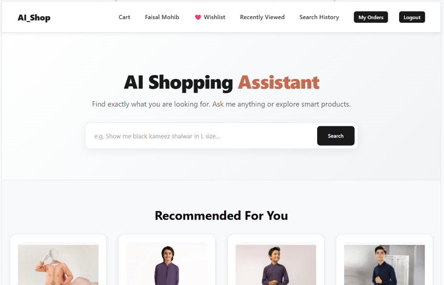

---

## 🛍️ Product Recommendations on Home Page

The system displays product recommendations to help users discover relevant products.

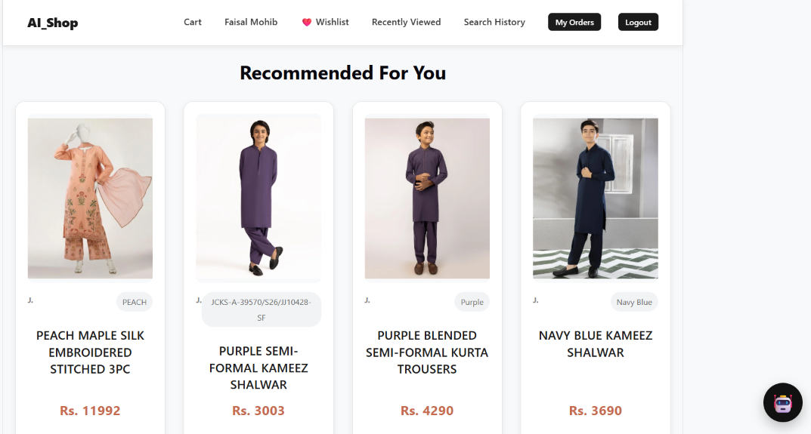

---

## 🔎 Product Details

The product details page provides detailed information about an individual product and includes recommendation functionality.

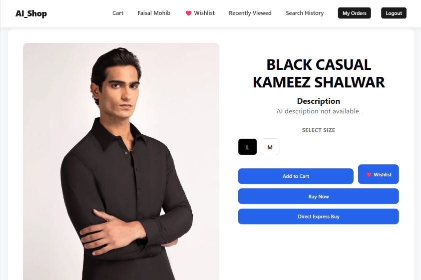

---

## 🎯 Recommendations in Product Details

Related/recommended products are displayed while viewing a product.


---

## 🛒 Shopping Cart

Users can review selected products and manage their shopping cart before checkout.

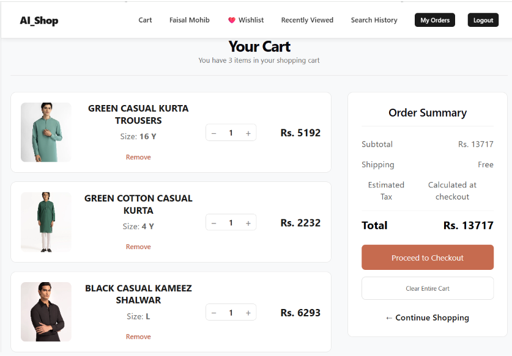

---

## 💳 Checkout

The checkout interface allows users to review their purchase information before completing an order.

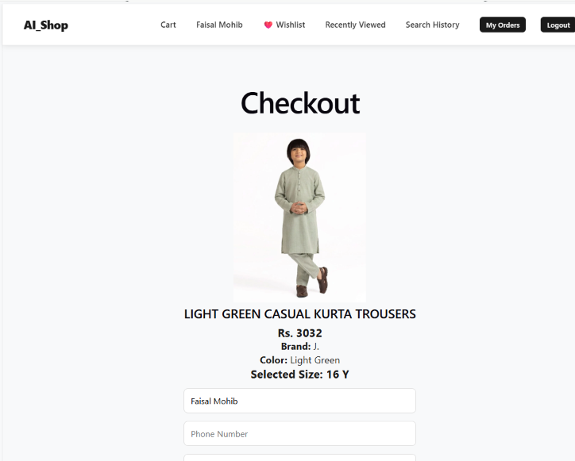

---

## 🛍️ Purchase / Checkout Flow

This screenshot demonstrates the purchase-related checkout interface.

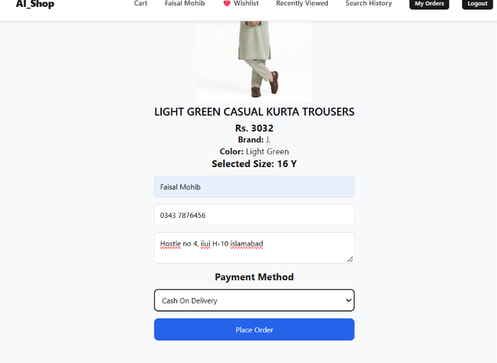

---

## 📦 Order Details

Users can view information about their placed orders.

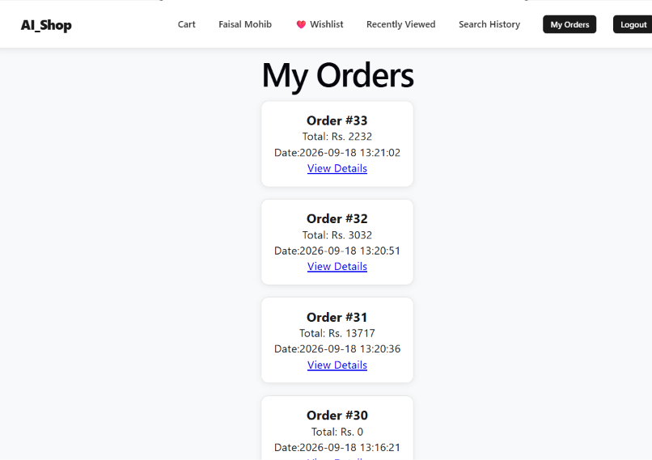

---

## ❤️ Wishlist

Users can save products to their wishlist for later.

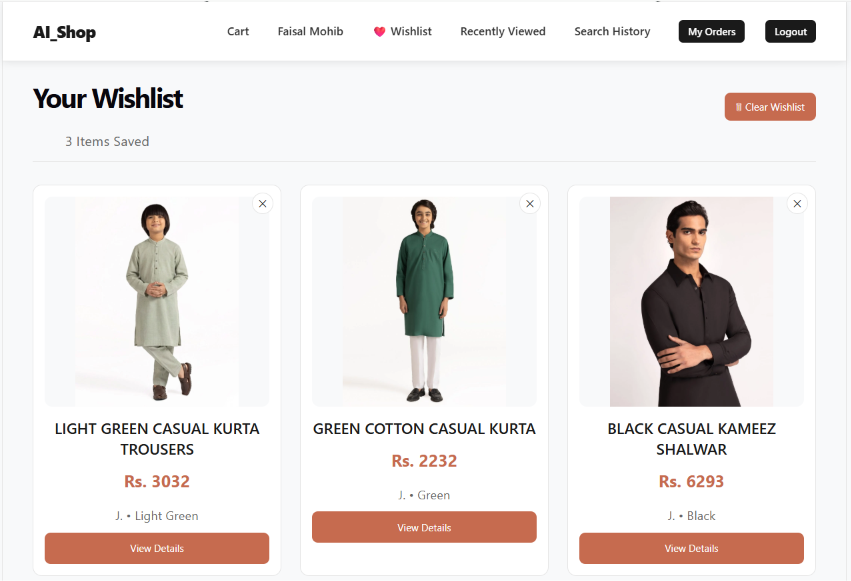

---

## 🕐 Recently Viewed Products

The system keeps track of recently viewed products to improve the shopping experience.

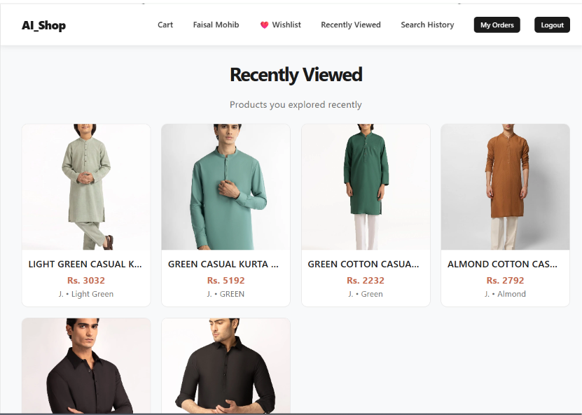

---

## 🔎 Search History

Users can view their previous product searches.

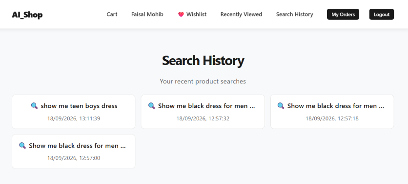

---

# 🤖 AI Customer Facilitation Chatbot

## Chatbot Interface

The application includes a conversational AI interface for customer questions.

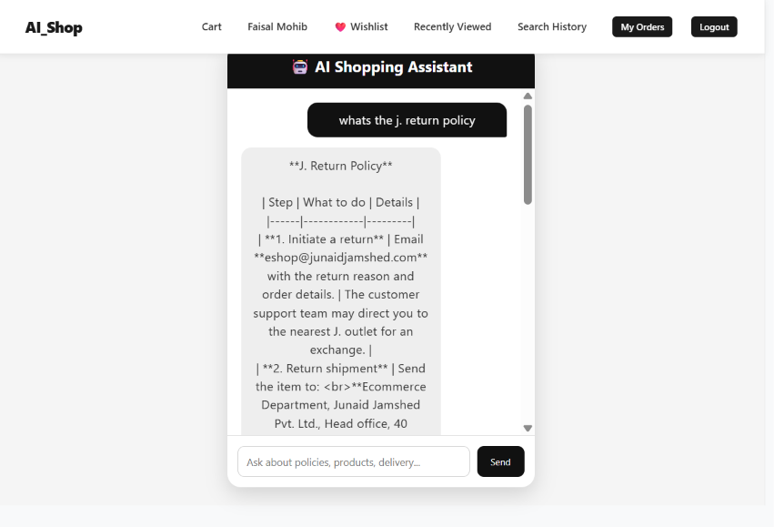

---

## 💬 Customer Query

Customers can ask questions using natural language.

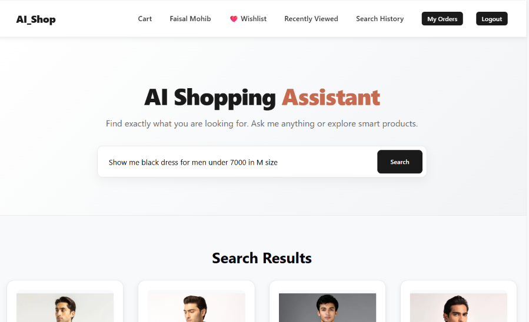

---

## 🧠 System to Customer Response

The chatbot retrieves relevant information from the knowledge base and generates a response for the customer.

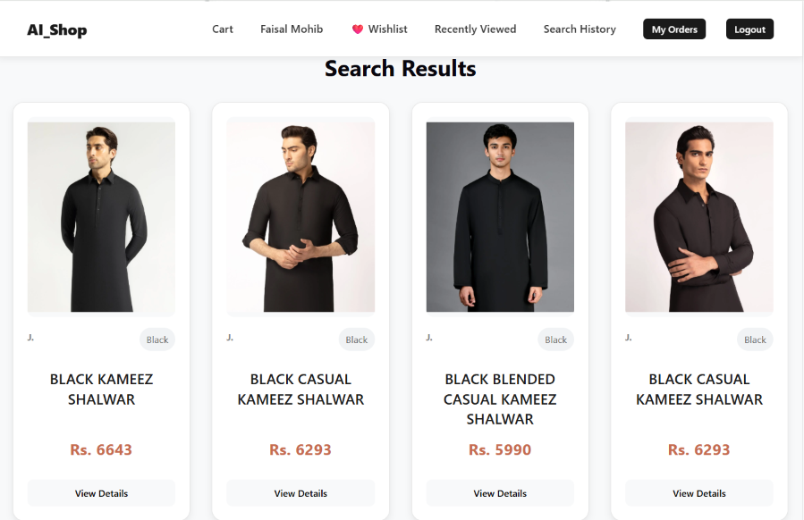

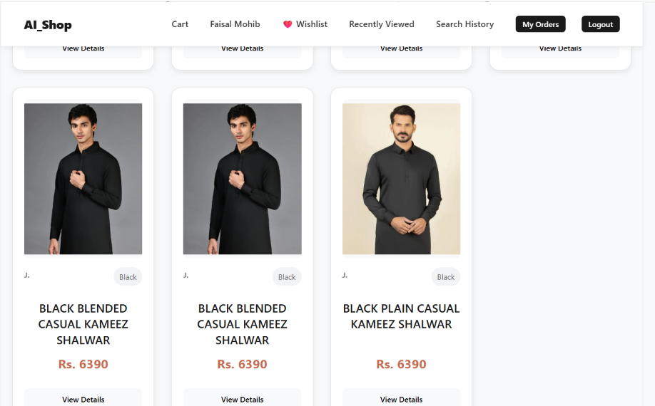

---

# 🔄 AI Shopping Workflow

The overall shopping workflow can be summarized as:

```text
User
 │
 ├── Product Query
 │       ↓
 │   LLM Agent
 │       ↓
 │   Text-to-SQL
 │       ↓
 │   Database
 │       ↓
 │   Product Results
 │
 └── Customer Question
         ↓
       RAG
         ↓
   Knowledge Retrieval
         ↓
        LLM
         ↓
 Customer-Facing Answer
```

---

# 🧩 Agentic AI Components

## LangGraph

LangGraph is used to organize AI processing into structured workflows and agentic execution paths.

The agent can route different types of requests toward appropriate processing pipelines.

---

## Groq

Groq-powered LLM inference is used for language understanding and generation.

The LLM is involved in tasks such as:

* Natural-language understanding
* Text-to-SQL generation
* Customer chatbot responses
* Agentic decision-making
* AI-assisted product interactions

---

## Text-to-SQL

Text-to-SQL provides a natural-language interface to the structured e-commerce database.

Instead of requiring users to understand database schemas or SQL syntax, the LLM translates their request into a database query.

---

## RAG Pipeline

The RAG pipeline combines:

```text
User Question
      ↓
Query Processing
      ↓
Document Retrieval
      ↓
Relevant Context
      ↓
LLM
      ↓
Final Answer
```

This is primarily used for the customer-facilitation chatbot.

---

## Vector Search

The system uses embeddings and vector-based retrieval for semantic information retrieval and recommendation-related functionality.

---

# 🛠️ Technology Stack

## Backend

* Python
* FastAPI
* LangGraph
* LangChain
* Groq
* RAG
* Sentence Transformers
* ChromaDB
* FAISS
* SQLite

## Frontend

* React
* Vite
* JavaScript
* CSS

## AI / ML

* Large Language Models
* Text-to-SQL
* Retrieval-Augmented Generation
* Semantic Search
* Vector Embeddings
* Agentic Workflows
* Recommendation Systems

## Database

* SQLite

## Development Tools

* Git
* GitHub
* VS Code

---

# 📁 Project Structure

```text
AI-Shopping-Assistant/
│
├── backend/
│   ├── agent.py
│   ├── main.py
│   ├── database.py
│   ├── rag_agent.py
│   ├── rag_pipeline.py
│   ├── web_search_pipeline.py
│   │
│   ├── prompts/
│   ├── routes/
│   ├── services/
│   ├── recommendation/
│   └── data/
│
├── frontend/
│   ├── src/
│   │   ├── components/
│   │   ├── pages/
│   │   └── assets/
│   ├── package.json
│   └── vite.config.js
│
├── Data/
│
├── Scrappers/
│
├── components/
│
├── build_embeddings.py
├── requirements.txt
├── .env.example
├── .gitignore
└── README.md
```

---

# 🚀 Installation

## 1. Clone the Repository

```bash
git clone https://github.com/faisalmohib/AI-Shopping-Assistant.git
cd AI-Shopping-Assistant
```

---

## 2. Create Python Virtual Environment

```bash
python -m venv venv
```

Activate it on Windows:

```bash
venv\Scripts\activate
```

---

## 3. Install Backend Dependencies

```bash
pip install -r requirements.txt
```

---

## 4. Configure Environment Variables

Create a `.env` file in the project root.

```env
GROQ_API_KEY=your_groq_api_key_here
TAVILY_API_KEY=your_tavily_api_key_here
```

Do not commit real API keys to GitHub.

A sample environment file is included as:

```text
.env.example
```

---

# ▶️ Run the Backend

Start the FastAPI server:

```bash
uvicorn backend.main:app --reload
```

The backend will start locally using the FastAPI development server.

---

# ▶️ Run the Frontend

Open another terminal:

```bash
cd frontend
```

Install dependencies:

```bash
npm install
```

Start the development server:

```bash
npm run dev
```

Open the local URL shown by Vite in your browser.

---

# 🔐 Security

The repository is configured to avoid committing sensitive and generated files.

The `.gitignore` excludes:

* `.env`
* API keys/secrets
* Virtual environments
* `node_modules`
* Database files
* Generated vector stores
* Python cache files
* IDE configuration files
* Temporary files

Use `.env.example` as a template for required environment variables.

---

# 🎯 Project Objectives

The main objectives of the project are:

1. Build an intelligent e-commerce shopping platform.
2. Enable natural-language product querying using LLM-powered Text-to-SQL.
3. Retrieve structured product information directly from the e-commerce database.
4. Build an AI customer-facilitation chatbot using RAG.
5. Provide knowledge-grounded answers to customer questions.
6. Implement semantic product discovery and recommendations.
7. Combine AI agents with conventional e-commerce functionality.
8. Provide a modern React-based user interface.
9. Develop a practical end-to-end AI application using FastAPI and modern LLM technologies.

---

# 🔮 Future Improvements

Potential future improvements include:

* More advanced multi-agent collaboration
* Improved Text-to-SQL validation and query safety
* Better conversational shopping memory
* Personalized recommendations
* Product comparison through natural language
* Voice-based shopping assistant
* More robust RAG evaluation
* Advanced recommendation models
* Production deployment
* Automated AI evaluation and monitoring

---

# 👨‍💻 Developer

**Faisal Mohib**

BS Information Technology
International Islamic University Islamabad

### Areas of Interest

* Artificial Intelligence
* Machine Learning
* Generative AI
* Agentic AI
* Retrieval-Augmented Generation
* LLM Applications
* AI Automation
* Full-Stack AI Development

---

# 📄 License

This project was developed as an academic and portfolio project for demonstrating AI, agentic systems, and full-stack e-commerce development.
